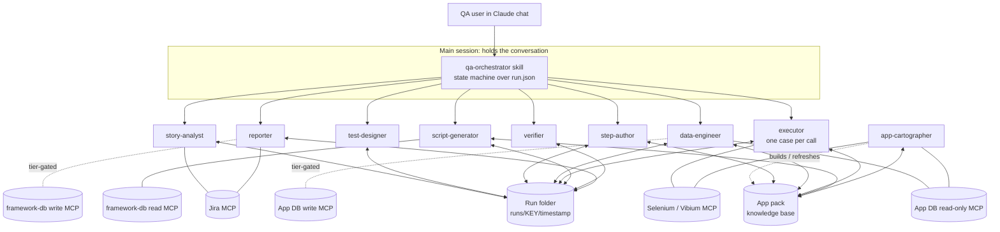

# QA OS — Agentic QA Automation on Claude Code

| | |
|---|---|
| **Status** | Design v1.0, for review |
| **Date** | 2026-09-25 |
| **First application** | S&D / DCODE (pilot story SDMS-10351) |
| **Next application** | GIAS (General Insurance Administration System) |
| **Scope** | Jira story → test cases → test steps → test data → live execution → selenium-framework-db scripts → framework run → Jira update |

---

## 1. Purpose

QA teams today write test cases and steps by hand from Jira stories, run them manually, and
separately author automation config for the Selenium-Framework. QA OS turns that into an
**agentic life cycle** that runs inside Claude:

- A QA user opens Claude (desktop or CLI) and asks, for example: *"run the QA cycle for SDMS-10351"*.
- A set of specialist agents reads the story, designs the test cases, writes executable
  steps, finds or seeds the test data, runs the cases in a real browser, and turns the
  passing flows into `selenium-framework-db` scripts.
- A human reviews one package at the end. Then the scripts are applied, the
  Selenium-Framework runs them without any AI, and the results go back to the Jira ticket.

It is designed as a **platform** ("Claude OS for QA"), not a one-off for S&D. Everything
application-specific lives in an **app pack**, so adding GIAS or any other system means adding
knowledge, not changing agents.

## 2. Design principles

1. **App-agnostic core, app-specific knowledge.** Agents, skills and hooks know nothing about
   S&D or GIAS. App packs hold the menus, screens, tables, login flows and conventions.
2. **Claude authors, the engine replays.** Claude is used where judgement is needed:
   understanding stories, designing cases, discovering the UI, diagnosing failures. Once a flow
   is proven it becomes structured data that a deterministic player (the Selenium-Framework
   engine) replays with no LLM, so it's fast, cheap and repeatable.
3. **Files, not conversation, carry the work.** Agents hand off through versioned files in a
   run folder. No single context window has to hold the whole ticket, and any stage can be
   re-run on its own.
4. **Safe by construction.** Permissions are enforced by database grants, connector
   configuration and hooks, never only by instructions in a prompt. Production is never a
   target.
5. **Proven, not invented.** Every locator, step and SQL row must trace back to something
   actually observed in the live application or database.
6. **One data row per case during AI execution.** When Claude drives the app through
   Selenium/Vibium MCP, each test case runs with a **single representative data row**. That's
   enough to execute the flow and reach every page and element it touches. Bulk test-data
   templates and data-driven Excel files are **not** used during AI execution. Bulk and
   data-driven runs belong to the deterministic Selenium-Framework engine after scripts are
   published (§13).
7. **Humans at the decisions that matter.** The pipeline runs unattended between a small
   number of explicit checkpoints: ambiguities, data writes, final review, Jira update.

## 3. Users and roles

| Role (tier) | Who | What they can do |
|---|---|---|
| **Designer** | QA analyst | Analyse stories; generate test cases, steps and data plans; read app DB |
| **Tester** | QA engineer | Everything above + execute cases live in dev/QA environments |
| **Data admin** | Senior QA / DBA-approved | Everything above + apply generated seed and cleanup DML on the application DB |
| **Framework admin** | Automation owner | Everything above + apply generated scripts to `selenium-framework-db` |
| **Framework runner** | Selenium-Framework user | Runs published flows in the Selenium-Framework and feeds results back for the Jira update |

The tier is per user and is enforced technically (§11), not by trust.

## 4. End-to-end life cycle

```mermaid
flowchart LR
  A[Jira key] --> B[Analyse story]
  B -->|ambiguities?| H1{{Checkpoint 1<br/>answer or accept}}
  H1 --> C[Design test cases]
  C --> D[Author test steps]
  D --> E[Resolve / seed test data]
  E -->|DML needed| H2{{Checkpoint 2<br/>approve DML}}
  H2 --> F[Execute cases live]
  E --> F
  F --> G[Generate framework scripts]
  G --> V[Independent verification]
  V --> H3{{Checkpoint 3<br/>final review}}
  H3 --> P[Apply to selenium-framework-db]
  P --> R[Framework run, no LLM]
  R --> J{{Checkpoint 4<br/>approve Jira update}}
  J --> K[Jira updated]
```



| # | Stage | Output | Typical duration |
|---|---|---|---|
| 1 | Analyse story | `requirement.json` + ambiguity list | minutes |
| 2 | Design test cases | `cases.json` + team-format workbook | minutes |
| 3 | Author steps | `steps.json` (step DSL) + Test Steps column filled | minutes |
| 4 | Test data (one row per case) | `data.json`, or `seed.sql` + `cleanup.sql` | minutes |
| 5 | Execute | `results/TCnn.json` + screenshots + locator updates | ~1–3 min per case |
| 6 | Generate scripts | `framework.sql` | minutes |
| 7 | Verify | `review.md` | minutes |
| 8 | Publish & report | results workbook, Jira comment, framework apply | after approval |

## 5. Architecture



### 5.1 Why the orchestrator is a skill in the main session

- It has to talk to the user at every checkpoint, and only the main session holds the
  conversation.
- Keeping agents one level deep (the orchestrator calls specialists, and specialists don't call
  further agents) is simpler to control, debug and cost-manage. Claude Code keeps nested
  subagents off unless `CLAUDE_CODE_MAX_SUBAGENT_SPAWN_DEPTH` is raised, and we keep it off.
- The orchestrator stays **thin**:
  1. read `run.json`
  2. pick the next stage
  3. start one agent with a short brief ("inputs are these files, write this file")
  4. check that the output exists and passes its schema
  5. update `run.json`

  It never loads the full case list, screen catalog or evidence into its own context.

### 5.2 Components on Claude Code

| Claude Code feature | Used for |
|---|---|
| **Plugin** | Packages QA OS for distribution and versioning: agents, skills, commands, hooks, MCP definitions |
| **Subagents** (`agents/*.md`) | The specialists in §6, each with its own tools and model |
| **Skills** (`skills/*/SKILL.md`) | Procedures and knowledge loaded on demand: orchestrator, step DSL, Excel template, Jira conventions, per-app knowledge |
| **Commands** | Short entry points for users (§10) |
| **Hooks** (`hooks/hooks.json`) | Governance: permission gates, URL allow-lists, audit logging, output validation (§11) |
| **MCP servers** | Jira, app databases (read and write separately), selenium-framework-db, Selenium / Vibium browser |
| **Memory / CLAUDE.md** | Project conventions; per-user settings and tier in `settings.local.json` |

Plugin-shipped agents can't declare their own hooks, MCP servers or permission mode. Those are
defined at plugin level (`hooks/hooks.json`, `.mcp.json`) or in user settings, which is also
where governance belongs.

## 6. Agents

| Agent | Responsibility | Reads | Writes | Tools | Model |
|---|---|---|---|---|---|
| **story-analyst** | Turn a Jira story into a structured requirement: actors, preconditions, business rules, acceptance criteria, entities, screens, **ambiguities** (each quoting the story), and scope changes found in comments | Jira issue, comments, linked-issue titles; app pack `domain.md` | `requirement.json` | Jira MCP (read) | Opus |
| **test-designer** | Derive test cases: positive, `ALT-` negative, boundary, update rules, business effect, regression. Each case traced to a rule or AC; cases that go beyond the story are flagged | `requirement.json` | `cases.json`, workbook (team template), Notes sheet | Python/xlsx | Opus |
| **app-cartographer** | Build and refresh app knowledge: menu tree, screens, fields, widgets, validations, locators, table map, login recipe. Runs on demand ("learn this screen") and after releases | App DB metadata, menu API, live UI | App pack `knowledge/` + `locators/` | App DB (read), browser | Sonnet |
| **step-author** | Write executable steps for each case in the step DSL, using on-screen labels and menu paths from the app pack; renders them into the workbook's Test Steps column | `cases.json`, app pack | `steps.json`, workbook | App pack, App DB (read) | Sonnet |
| **data-engineer** | For each case, resolve **one** data row that satisfies its preconditions, using named data recipes (e.g. one active outlet of subtype X under the login distributor). Only when no such row exists, generate a minimal `seed.sql` + `cleanup.sql` for that single row; apply it only for Data-admin users after approval. No bulk data sets. | `steps.json`, app pack recipes | `data.json` (one row per case), `seed.sql`, `cleanup.sql` | App DB (read; write if tier allows) | Sonnet |
| **executor** | Run **one** case: fresh login, execute steps, check UI and DB assertions, capture screenshots, heal locators, classify failures as `app-defect / test-defect / data / environment` | `steps.json` (one case), `data.json`, app pack | `results/TCnn.json`, `evidence/`, locator cache | Browser MCP, App DB (read) | Sonnet |
| **script-generator** | Convert passing results into `selenium-framework-db` rows (menu groups, screens, fields, events, flow, flow details) that match the live schema; every row traces to an executed step | Passing results, framework-db schema | `framework.sql` | framework-db (read) | Sonnet |
| **bulk-data-factory** | Generate **bulk case data** for the legacy Regress engine: one workbook per story in the engine's `casedata` format (§13A), with many rows per test case (positive, negative, boundary, combinations). Real master data is sampled from the app DB; expected messages come from the AI execution run. Works for QA OS flows **and for existing legacy flows** already in `CTA_CONFIG_ASSERTION`. | Published flow (screens, fields, `psf_field_db_column`), `cases.json`, screen knowledge, observed messages, app DB | `casedata/<file>.xlsx`, `casedata-report.md`, optional bulk `seed.sql` + `cleanup.sql` | App DB (read), framework-db (read) | Sonnet |
| **verifier** | Independent check: every AC has a case; every case has steps; every step has a verdict; every SQL row traces to evidence; no invented locators; the assumptions list is complete | Whole run folder | `review.md` | Read-only | Opus |
| **reporter** | Build the results workbook and summary; post a Jira comment or transition after approval; ingest Selenium-Framework run results | Run folder, framework results | `report.xlsx`, Jira update | Jira MCP (write, gated) | Sonnet |

**Planned later:**
- **defect-filer:** raises Jira bugs from `app-defect` failures, with evidence.
- **regression-selector:** picks the stored flows affected by a change.
- **flaky-analyst:** finds unstable flows.
- **impact-analyst:** maps a story to the existing flows that need an update.

## 7. The app pack

One folder per application under test. It is the only part that differs between S&D and GIAS.

```
apps/<app-id>/
  app.yaml                  # identity, environments, login recipe, connectors, defaults
  knowledge/
    domain.md               # how the business works, in plain language
    tables.json             # data dictionary / schema catalog
    menu.json               # menu tree: ids, labels, parents, routes
    screens/<screen>.json   # fields, widgets, locators, required/readonly, options, buttons, grid columns
    ui.md                   # verified UI behaviour, quirks, navigation recipe
    data-recipes.sql        # named, parameterised SELECTs for test data and DB assertions
  locators/                 # locator cache, healed during execution
  steps-vocabulary.md       # how DSL verbs map to this app's widgets (DevExtreme select, date box, grid row)
  excel-template.xlsx       # team's test-case workbook format (layout only)
```

**Example `app.yaml` (S&D):**

```yaml
id: snd
name: Sales & Distribution (DCODE)
environments:
  cnr2dev3: { url: https://dcodecnr2dev3.unilever.com/ngui, db_read: snd-schema, users: [KPO_ph, KPO_slv] }
  cnr1dev1: { url: https://dcodecnr1dev1.unilever.com/ngui, users: [KPO_mp] }
allowed_hosts: [dcodecnr2dev3.unilever.com, dcodecnr1dev1.unilever.com]
login:
  steps:
    - fill: { css: "input[name=username]", env: SD_TEST_USER }
    - fill: { css: "input[name=password]", env: SD_TEST_PASSWORD }
    - click: { css: "button[type=submit]" }
    - choose: { widget: dx-select, label: Distributor, value: "{{distributor}}" }
    - click: { text: Proceed }
  logout: { click: { css: "li#logout" }, after: { click: { text: "{{user}}" } } }
menu:
  source: api            # GET /menu-service/api/v1/optionGroup/allMenusByRoles (role-filtered)
  navigate: search       # click li#<top>, type into input[name=filterText], click li#<option>
framework_db: selenium-framework-db
```

**Current state of the S&D app pack** (in `regress-master/docs/snd-tables/`, to be moved into `apps/snd/`):
- Data dictionary: 548 tables and 10,808 columns, with a lookup script.
- Domain notes from the live DB.
- Full menu catalog from the security tables, plus the role-filtered menu API.
- Raw extracts of 943 dynamic page configs and 301 layouts, not yet parsed.
- The SKU Substitution Policy screen, verified live.

**GIAS** already has a login flow, a menu catalog, an element cache and a flow JSON format. They
move into `apps/gias/`.

## 7A. Knowledge sources: learning an application without documentation

**Assumption: there is no user guide and no documented flow.** For any system, the only
inputs are:
- **the application database**, which holds both business data and metadata (users, roles,
  menus, application options, screen definitions);
- **the running application**;
- **the Jira stories**.

QA OS must build all the application knowledge it needs from these, and keep it current.

### 7A.1 What the organisation provides (one-time, per application)

| Input | Form | Used for |
|---|---|---|
| **Application DB connector** (read-only, via MCP) | e.g. `snd-schema` | Metadata harvest, test data lookup, DB assertions |
| **Environment URL(s)** | e.g. cnr2dev3 | Live harvest and execution |
| **Test users per role / region** | username + password in `settings.local.json` | Login; role-filtered menus; region variants |
| **Jira access** | Atlassian MCP, or pasted export | Stories, comments, linked issues |
| **Framework DB connector** | `selenium-framework-db` → `CTA_CONFIG_ASSERTION` | Existing flows as examples; target for generated scripts |
| **Team test-case template** | one `.xlsx` | Output format only |
| **Optional: data dictionary** | e.g. the S&D DD workbook | Column meanings; FK hints the DB doesn't declare |

**Nothing else is required.** During a run, the only things asked of a person are answers to
story ambiguities and approvals (§12).

### 7A.2 What is harvested, and from where

| Knowledge | Source (S&D example) | How |
|---|---|---|
| **Applications, options, menu tree** | `smm_pr_app_applications`, `smm_pr_apo_appoption`, `smm_pr_opg_optiongroups` (hierarchy by parent id) | SQL harvest |
| **Who can see what** | `smm_pr_rol_role`, `smm_pr_rop_roleoption`, `smm_pr_url_userroles`, `smm_pr_sus_user`, `smm_pr_usl_userlocation` | SQL: choose a test user whose role reaches the screen |
| **Role-filtered menu actually shown** | `GET /menu-service/api/v1/optionGroup/allMenusByRoles` | Live, once per user/env |
| **Screen definitions (metadata-driven screens)** | `dyp_dp_pgm_pagemeta` (backing table), `dyp_dp_pgl_pagelayout` (panels), `dyp_dp_pgc_pageconfiguration` (controls: name, dataField, required, readOnly, maxLength, validations) | SQL harvest + JSON parse |
| **Dropdown / lookup sources** | `dyp_dp_dlc_datalistconfig` (query per data list) | SQL: gives both valid and invalid values for negative tests |
| **Labels and translations** | `*_m` tables (multi-language), app `asset/i18n/<lang>.json` | SQL + live fetch; resolves i18n keys like `DYP.P.101055…` to on-screen text |
| **Hand-coded screens** (no page metadata, e.g. `/content-master/mobility/sku-substitution-policy`) | Rendered UI + the app's network calls | Live harvest: fields, ids, required markers, options, button states by mode; API calls reveal backing endpoints |
| **Business entities and rules** | Tables, PK/FK constraints, `*_active` flags, date ranges, document types and statuses | Schema harvest + data profiling |
| **Validation rules** | Validation module tables, `fieldValidations` in page config, messages observed live | SQL + observed |
| **Upload screens** | File-uploader setup tables, downloaded template columns | SQL + live |
| **How flows are expressed for the engine** | `CTA_CONFIG_ASSERTION` (`fct_pr_mg_menu_group`, `fct_pr_sc_screens`, `fct_pr_sf_screen_field`, `fct_pr_sef_screen_events_flow`, `fct_pr_sq_screen_query`, `fct_pr_tf_test_flow`…) | SQL: existing flows are templates and a source of proven locators |
| **Behaviour** | Every execution | Locators, messages, timings, state transitions are written back to the app pack |

### 7A.3 The app-learning pipeline (app-cartographer)

1. **Static harvest.** Pull the metadata above into `knowledge/` (menu, roles, screens,
   lookups, labels, table catalog). Runs once, then on demand.
2. **Live harvest per environment.** For each test user, fetch the role-filtered menu and the
   i18n files. Render screens and capture fields, widgets, locators, options and button
   states. Hand-coded screens are harvested only this way.
3. **Safe probing (dev only).** Learn validations without creating data:
   - Try an empty save and read the required-field messages.
   - Type over-length text and check the length limit.
   - Open each dropdown and record its options.
   - Never confirm a save, update or delete while learning.
4. **Consolidate.** Write one `screens/<option-id>.json` per screen. Every fact carries its
   provenance: `db-declared`, `observed`, or `inferred`. Steps prefer `observed`.
5. **Link story to screen.** Match story terms to menu labels, option ids, backing tables and
   linked-issue titles. Ask only if the match is ambiguous.
6. **Learn continuously.** Every run adds or heals locators, messages and rules. Anything that
   contradicts the stored knowledge is flagged as a possible app change.

### 7A.4 Region and version variation

The business flow is the same everywhere. What varies by region, country and release is
screens, menu entries, fields and data. For example, the SKU Substitution screens exist on
cnr2dev3 but not in the `snd-schema` copy. So knowledge is **layered**:

- **Base layer:** from the application DB (`snd-schema`). The business model, tables, the
  common menu and screens.
- **Environment overlay:** from each live environment and its test users. Which screens exist
  for this region and role, and how they actually render.
- **Resolution:** agents resolve the overlay first, then the base. The cartographer reports the
  differences (e.g. "screen present in env, not in base DB").
- **Missing DB data:** when the DB copy lacks a feature's tables, DB assertions for that
  feature fall back to UI assertions, and the gap is recorded in the run's `review.md`.

## 8. Run folder and hand-off contracts

```
runs/<JIRA-KEY>/<yyyymmdd-hhmm>/
  run.json                     # manifest: app, env, user, tier, stage states, timings, output links
  requirement.json
  cases.json
  <KEY>_TestCases.xlsx
  steps.json
  data.json | seed.sql + cleanup.sql
  results/TC01.json …
  evidence/TC01_step03.png …
  framework.sql
  casedata/NG_<App>_QA_<KEY>.xlsx  # bulk case data for the legacy engine (§13A)
  casedata-report.md
  review.md
  report.xlsx
  audit.jsonl                  # every write: who, when, tool, target, statement hash
```

**`run.json` (excerpt):**

```json
{
  "key": "SDMS-10351", "app": "snd", "env": "cnr2dev3", "user": "qa.user", "tier": "tester",
  "stages": {
    "analyse":  {"state": "done", "out": "requirement.json"},
    "cases":    {"state": "done", "out": "cases.json", "count": 50},
    "steps":    {"state": "done", "out": "steps.json"},
    "data":     {"state": "needs-input", "reason": "seed.sql awaiting Data-admin approval"},
    "execute":  {"state": "pending"},
    "scripts":  {"state": "pending"},
    "verify":   {"state": "pending"},
    "report":   {"state": "pending"}
  }
}
```

- **Stage states:** `pending → running → done | needs-input | failed`.
- **Partial re-runs:** users can re-run part of a run, e.g. "re-author steps for TC 7–9" or
  "re-execute failed cases".
- **Schemas:** each output file has a JSON schema, checked by a hook when the agent finishes.

## 9. Step DSL

Steps are **structured data**. The Excel "Test Steps" column is a readable rendering of it,
and the executor and script-generator consume the same data.

```json
{
  "case": "TC05",
  "title": "Verify only End Date is editable for a current policy",
  "steps": [
    {"do": "login",     "as": "dt_user", "distributor": "{{data.distributor}}"},
    {"do": "navigate",  "menu": "Transaction > SKU Substitution Policy"},
    {"do": "select_row","grid": "SKU Substitution Policy", "where": {"Policy code": "{{data.currentPolicy}}"}},
    {"do": "verify_ui", "expect": {"field": "Description", "state": "readonly"}},
    {"do": "verify_ui", "expect": {"field": "Start Date",  "state": "readonly"}},
    {"do": "verify_ui", "expect": {"field": "End Date",    "state": "editable"}},
    {"do": "set_date",  "field": "End Date", "value": "{{today+10}}"},
    {"do": "click",     "button": "Update"},
    {"do": "verify_ui", "expect": {"message": "contains:updated"}},
    {"do": "verify_db", "recipe": "policy_end_date", "args": {"code": "{{data.currentPolicy}}"}, "expect": "{{today+10}}"},
    {"do": "logout"}
  ]
}
```

| Verb | Meaning |
|---|---|
| `login` / `logout` | App-pack login recipe; credentials come from env vars only |
| `navigate` | Menu path; resolved to ids with the app pack's navigation recipe |
| `enter`, `choose`, `set_date`, `check` | Fill a field by its on-screen label |
| `click` | Button or link by label |
| `select_row` | Grid row by column values |
| `download`, `upload`, `edit_excel` | File steps; files live in the run folder |
| `verify_ui` | Field state, message, grid content |
| `verify_db` | Named data recipe with expected value; this is how business effects are tested |
| `capture` | Store a value from the screen for later steps (e.g. the generated policy code) |

Placeholders `{{…}}` resolve from `data.json`, date expressions (`today±n`), generators, or captured values.

**Data rule for AI execution:** each case binds to exactly **one** row in `data.json`. The goal
of a Claude-driven run is to prove the flow works and to capture every page, element and
locator along it. One representative row does that. Running the same flow over many rows adds
cost and time without adding knowledge.

**Parameters for bulk runs later:** when script-generator publishes a flow, it records which
fields are data parameters. The Selenium-Framework engine can then run it over many rows later
(bulk / data-driven regression), with no AI involved.

## 10. User experience

**In Claude chat:**
- *"Show me SDMS-10351"*: the story summary and the state of any existing run.
- *"Run the QA cycle for SDMS-10351"*: the full life cycle, pausing at checkpoints.
- *"Only generate test cases for SDMS-10351"*, or *"re-run the failed cases"*.

**Commands:**

| Command | What it does |
|---|---|
| `/qa-os:run <KEY> [--until <stage>] [--env <env>]` | Full life cycle, or up to a given stage |
| `/qa-os:cases <KEY>` | Analyse the story and design test cases |
| `/qa-os:steps <KEY>` | Author steps for the existing cases |
| `/qa-os:data <KEY>` | Resolve or seed test data |
| `/qa-os:exec <KEY> [TC…]` | Execute all or selected cases |
| `/qa-os:scripts <KEY>` | Generate `selenium-framework-db` scripts |
| `/qa-os:bulk <KEY> [--rows N] [--cases TC…] [--negatives-only] [--refresh]` | Generate bulk case data for the story's published flow (§13A) |
| `/qa-os:bulk --flow <ptf_testflowid> [--rows N]` | Generate bulk case data for an existing legacy flow |
| `/qa-os:review <KEY>` | Show the verification package |
| `/qa-os:report <KEY> [--framework-results <file>]` | Results workbook and Jira update |
| `/qa-os:status [KEY]` | Run state for one or all tickets |
| `/qa-os:learn <app> [<menu path>]` | Build or refresh app knowledge for a screen or area |

## 11. Governance and security

### 11.1 Enforcement layers

| Layer | Mechanism |
|---|---|
| **Connectors** (primary boundary) | Users don't get direct DB access; MCP connectors are the controlled access point. Read connectors (`snd-schema`, `selenium-framework-db`) accept SELECT only. Write connectors (`<app>-dml`, `framework-db-write`) are separate servers configured only in the settings of users with the matching tier, so other users don't have the tool at all. |
| **Database** (recommended hardening) | If the organisation can, back each write connector with a DB user whose grants are limited to test tables (no DDL), so a misconfigured hook still can't damage anything. |
| **Hooks** | Gate every write, allow-list URLs, protect source trees, audit (§11.2) |
| **Approval** | Every DML or framework apply requires explicit approval in chat for that specific script |

### 11.2 Hooks

| Event | Matcher | Purpose |
|---|---|---|
| `SessionStart` | — | Load the user's tier and app packs; list open runs |
| `PreToolUse` | App DB / framework-db write tools | Allow only if the tier permits, the statement hash matches an approved script in the current run, and the target is not production |
| `PreToolUse` | Browser `navigate` | Host must be in the app's `allowed_hosts` |
| `PreToolUse` | `Write` / `Edit` / `Bash` | Block writes to application source trees and destructive commands (generalises the GIAS guardrail) |
| `PostToolUse` | All write tools, Jira write | Append to `audit.jsonl`: user, run, tool, target, statement hash, result |
| `SubagentStop` | All QA OS agents | Validate the agent's output file against its schema; mark the stage `failed` with the reason if it doesn't match |

### 11.3 Data safety rules

- **Environments:** production is never a target. Allowed hosts and DB connectors cover dev/QA
  environments only.
- **Seed and cleanup:** every seed script comes with a cleanup script. Seeded rows are tagged
  (for example `created_by = 'QAOS:<run-id>'`) so they can be found and removed.
- **Credentials:** they live in env vars in the gitignored `settings.local.json`. They are never
  written to run files, workbooks, logs or chat.
- **Passwords:** Claude doesn't type them. Login is performed by the deterministic runner from
  env vars, or by the user in the browser during interactive discovery.

## 12. Human checkpoints

| # | Checkpoint | Default | Skippable? |
|---|---|---|---|
| 1 | Story ambiguities: answer or accept the defaults | On | Yes, per team |
| 2 | Apply seed / cleanup DML | **Always** | No |
| 3 | Final review: `review.md`, failures with evidence, `framework.sql` | On | No for first runs on a new screen |
| 4 | Jira comment / transition | On | Yes, per team |
| 5 | Apply to `selenium-framework-db` | **Always** | No |

## 13. After scripts are published

1. A **Framework admin** applies the reviewed `framework.sql` (checkpoint 5).
2. The **Framework runner** executes the flows in the Selenium-Framework, with no LLM. This is
   where bulk runs happen: the engine reads the case-data workbook from bulk-data-factory (§13A).
3. The results are fed back: `/qa-os:report <KEY> --framework-results <file>`.
4. reporter updates the Jira ticket (checkpoint 4).
5. Replay failures go back to the executor for diagnosis and locator healing, and the updated
   script is reviewed again.

## 13A. Bulk case data for the legacy Regress engine

The QA team's main need: **generate test data in bulk for a story or test case**. It fits the
life cycle like this:

- **During AI execution (stage 5):** one row per case (principle 6). Its job is to prove the
  flow, and to learn the rules and messages along the way.
- **After scripts are generated (stage 6 onward):** **bulk-data-factory** produces the bulk
  case data that the legacy Regress engine reads to run the published flow over many rows,
  exactly as the team does today.

### 13A.1 The engine's case-data contract (verified from engine source and `CTA_CONFIG_ASSERTION`)

| Aspect | Rule |
|---|---|
| **File location** | `<app base path>\casedata\<fileName>.xlsx`. The base path comes from `fct_pr_app_application.papp_base_path` (e.g. `D:\Selenium\Automation\PHP_QA\`), overridable with config `BASEPATH_<appId>` |
| **File name** | `fct_pr_tfd_test_flow_details.ptfd_filename` if set, otherwise `fct_pr_mgsm_menu_group_screen_mapping.pmgsm_screen_filename`, otherwise the app's default result file. Existing examples: `NG_Dcode_QA_OTC`, `NG_Dcode_QA_Setup`, `NG_Dcode_QA_OTC_Negative`, `NG_Dcode_QA_SDMS-10080` (a story-specific workbook) |
| **Sheets** | One sheet per screen; sheet name = `fct_pr_sc_screens.psc_screenname` |
| **Header row** (row 1, case-insensitive) | One column per field = `fct_pr_sf_screen_field.psf_field_db_column`, plus control columns: `PK`, `PK_DESC`, `STPONERR`, `CASE_TYPE`, `EXPECTED_INPUT`, `EXPECTED_MESSAGE`, `CHECK_VALIDATION`, `EVENT_ID`, `SWIPE`, and `repo_*` columns for repository-sourced fields |
| **Rows** | Each row is one case iteration. Rows with all cells empty are skipped |
| **Keys across screens** | `PK` identifies the row and links parent and child screens (the child sheet uses the same `PK`). Repeated loads use `PK#2`, `PK#3`… |
| **Outcome columns** | `CASE_TYPE` (positive/negative), `EXPECTED_MESSAGE`, `EXPECTED_INPUT` and `CHECK_VALIDATION` drive the engine's assertions. `STPONERR = Y` stops on the first error |

Exact control-column semantics are confirmed against more engine source in P3, before the
first file is delivered.

### 13A.2 How bulk data is generated

1. **Read the flow:** the screens, the fields and their `psf_field_db_column`, and the
   parent/child links. It comes from the generated `framework.sql`, or directly from
   `CTA_CONFIG_ASSERTION` for an existing legacy flow.
2. **Read the rules for each field** from screen knowledge: type, required, max length,
   options, lookup source, date rules. Add the **messages observed** during the one-row AI
   run, e.g. the text shown when Description is blank.
3. **Choose values for each test case:**
   - **Positive rows:** real master data sampled from the app DB through data recipes (e.g.
     active outlets of subtype X under the distributor), plus generated unique values for key
     fields, tagged with the run id.
   - **Negative rows:**
     - blank required fields;
     - values over the maximum length;
     - codes that don't exist, or that are inactive, taken from the lookup's source query;
     - wrong date order;
     - each with `CASE_TYPE = negative` and the expected message.
   - **Boundary rows:** min and max lengths, today, start date equal to end date, the day
     after the end date.
   - **Combinations:** pairwise across multi-value fields, to keep row counts reasonable.
4. **Size:** the QA user chooses the volume, e.g. "50 rows", "every active outlet subtype",
   "pairwise only", or "negatives only".
5. **Link and key:**
   - Assign `PK` / `PK_DESC`.
   - Fill child sheets with matching `PK`s.
   - Resolve relative dates to real dates at generation time. Regenerate before a later run
     with `--refresh`.
6. **Validate before delivery:**
   - every header maps to a flow field;
   - every positive row fills all required fields;
   - every referenced master record still exists and is active in the DB;
   - no duplicate keys.
7. **Seed only when needed:** if rows need master data that doesn't exist, create a bulk
   `seed.sql` + `cleanup.sql` under the Data-admin rules (§11). Rows are tagged, cleanup is
   paired, and nothing runs without approval.
8. **Deliver:**
   - Write `casedata/NG_<App>_QA_<JIRA-KEY>.xlsx`, following the existing naming, to the run
     folder.
   - script-generator sets `ptfd_filename` to that name in `framework.sql`.
   - A Framework admin or runner places the file in the engine's `casedata` folder.
   - `casedata-report.md` lists row counts by case and type, and the assumptions made.

### 13A.3 Uses the QA team gets

- **For a story processed by QA OS:** the full life cycle ends with `framework.sql` plus a
  ready bulk case-data workbook.
- **For existing legacy flows, independently of the rest:**
  `/qa-os:bulk --flow <ptf_testflowid> --rows 100` reads the flow from
  `CTA_CONFIG_ASSERTION` and generates the case-data workbook. This gives value from day one.
- **For a subset:** `/qa-os:bulk <KEY> --cases TC05,TC07 --negatives-only`.

## 14. Context management

| Technique | Effect |
|---|---|
| One stage per agent, one case per executor call | Each context holds only what that task needs |
| File hand-offs | The orchestrator passes paths, not content |
| Skills loaded on demand | App knowledge is pulled in only by the agents and stages that need it |
| Split knowledge (`screens/<id>.json`, not one big file) | Agents read one screen, not the whole app |
| Lookup scripts (`dd_lookup.py`, menu search) | Large catalogs are queried, never read whole |
| Large query results to files | Parsed with scripts instead of loaded into context |

## 15. Repository and distribution

```
qa-os/                                  # one git repo, also a plugin marketplace
  .claude-plugin/marketplace.json
  plugins/qa-os/
    .claude-plugin/plugin.json
    agents/        story-analyst.md  test-designer.md  app-cartographer.md  step-author.md
                   data-engineer.md  executor.md  script-generator.md  verifier.md  reporter.md
    skills/        qa-orchestrator/  step-dsl/  excel-template/  jira-conventions/  app-knowledge/
    commands/      run.md  cases.md  steps.md  data.md  exec.md  scripts.md  review.md  report.md  status.md  learn.md
    hooks/         hooks.json  gate_writes.py  url_allowlist.py  audit.py  validate_output.py
    schemas/       requirement.schema.json  cases.schema.json  steps.schema.json  result.schema.json
    .mcp.json      # shared, non-secret connector definitions (Jira, browser)
  apps/
    snd/   …       # app pack (§7)
    gias/  …
  runs/            # gitignored, or stored per user/workspace
```

- **Install:** the team adds the marketplace with `/plugin marketplace add <repo>`, then runs
  `/plugin install qa-os`.
- **Updates:** plugin versions are tagged, so rolling out a change is a version bump.
- **Per-user setup:** tier, credentials and write connectors live in personal
  `settings.local.json`.
- **Engine relationship:** `regress-master` stays the deterministic engine and framework-db
  owner. QA OS is the agentic layer that authors content for it.

## 16. Delivery plan

| Phase | Scope | Exit criterion |
|---|---|---|
| **P0 Foundation** | Repo and plugin skeleton; `run.json` + schemas; step DSL v1; app-cartographer v1 (static harvest from `snd-schema` + live harvest from cnr2dev3); S&D app pack; login recipe; `CTA_CONFIG_ASSERTION` schema map | Login + navigate to SKU Substitution Policy from DSL, with no manual help |
| **P1 Design path** | story-analyst, test-designer, step-author, orchestrator skill; Jira read | SDMS-10351 → cases + steps that a QA lead accepts with minor edits |
| **P2 Execution** | executor, data-engineer (read-only), evidence, locator cache, failure classification | ≥ 70% of SDMS-10351 cases reach a verdict (pass/fail) unattended |
| **P3 Scripts + bulk data** | script-generator, verifier, bulk-data-factory; `CTA_CONFIG_ASSERTION` mapping; case-data contract confirmed from engine source | Generated `framework.sql` + bulk case-data workbook replay in the legacy engine with no LLM |
| **P3a Quick win (can start early)** | bulk-data-factory for **existing legacy flows** (`/qa-os:bulk --flow …`) | QA team generates bulk case data for a current flow that the engine runs successfully |
| **P4 Governance** | Tiers, write connectors, hooks, audit, reporter + Jira write | DML and framework applies gated, approved and audited |
| **P5 Second app** | GIAS app pack from the existing GIAS caches | One GIAS story end-to-end with **no** agent changes |
| **P6 Scale** | defect-filer, regression-selector, dashboards, batch execution | Team-wide rollout |

## 17. Success measures

- **Step accuracy:** % of generated steps accepted without edits.
- **Coverage:** % of cases that reach a verdict unattended.
- **Wrong passes:** cases passed by the system that a human would fail. The target is 0, and
  the verifier and sampling reviews measure it.
- **Time per story:** Jira key → reviewed scripts.
- **Replay stability:** % of published flows passing in the engine across releases.

## 18. Risks and open decisions

| # | Item | Status / proposal |
|---|---|---|
| 1 | **One application DB with regional/version variation.** `snd-schema` (`ng_astrone`) is the only S&D DB. It carries the base business model; newer or region-specific features (e.g. the SKU Substitution tables on cnr2dev3) may be absent. | **Decided:** layered knowledge (§7A.4). DB = base, live env = overlay. DB assertions fall back to UI assertions where the DB lacks the feature. |
| 2 | **DB access model.** Direct DB access isn't given; the MCP connectors are the controlled access point and enforce read-only. | **Decided:** connectors are the access boundary. Write tiers (§11) are added later as separate connectors that the organisation grants per user. |
| 3 | **Framework-db target** | **Decided:** `CTA_CONFIG_ASSERTION`, already reachable through the `selenium-framework-db` connector (21 tables, incl. `fct_pr_sq_screen_query` for DB assertions). |
| 4 | **Mobility-originated orders.** A browser can't drive the mobile app. | Integration API or DB seeding; otherwise mark those cases manual. |
| 5 | **Story ambiguities** (e.g. expired policies: the app shows them, the story is ambiguous) | Surfaced at checkpoint 1; a BA decides. |
| 6 | **Run cost and time** (a fresh login per case) | One case per executor call; batch replay through the engine once scripts exist. |
| 7 | **Jira access** | Atlassian MCP read for all users; writes only through reporter with approval. |
| 8 | **Credential sharing** | Test passwords were shared in chat. Rotate them and keep them only in `settings.local.json`. |

---

*Related documents:* `docs/snd-workflow/STATUS_AND_NEXT_STEPS.md` (current progress),
`docs/snd-tables/snd_ui_knowledge.md` (verified S&D UI), `docs/snd-tables/snd_domain_knowledge.md`
(S&D data model), `docs/snd-workflow/CLAUDE.md.draft` (earlier QA-writes-steps workflow, superseded by this design).
