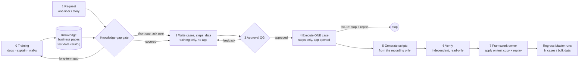

# QA OS design (v3, 2026-10-08) — DRAFT for review

Replaces v2 (2026-09-30, kept in `docs/history/FINAL_DESIGN_v2_2026-09-30.md`). v3 writes down the rules the QA lead set on 2026-10-06..08 while QA OS was used for S&D training and the first quick runs. Status: **design and development**; the platform is evolving. Open issues to close before the QA-environment release are in `docs/HARDENING.md`.

## 1. Purpose
QA OS turns a short QA request (a one-liner or a few lines; a Jira story is optional) into **scripts for Regress Master** — the legacy Selenium Regress framework, configured in `selenium-framework-db` (`CTA_CONFIG_ASSERTION`) — plus the **case data** (Excel) for N test cases. Regress Master then runs those cases (and later bulk data) **without AI**.

Claude's knowledge of the application comes from **training** given by the QA team, never from vendor documentation (there is none) and never by copying the old framework flows.

## 2. Principles
1. **Training first.** Claude knows only what it was trained on (documents, explanation, live walks). Untrained areas are not executed.
2. **Training only, up to execution.** Test cases, test steps and **test data** are written from trained knowledge only; the application is not opened and its database is not queried while writing them.
3. **Ask, don't guess.** A missing piece of knowledge is a *knowledge gap*: a short gap is asked and the run continues; a long-term gap needs training and the run does not execute.
4. **One live run.** The AI executes the flow **once, on a single case's data**, following the approved steps, only to discover screens, elements, ids, tabs and messages. All N requested cases become case-data rows.
5. **The recording is the only source for scripts.** Screens, fields, ids, events and messages in the generated SQL come from what the run observed. The framework DB is read only for table structure, required columns, valid event types and free ids. Old flows are never copied or mirrored.
6. **Every message is an assertion.** Toasts, popups and inline validations become checks; browser-alert texts are listed when the engine cannot assert them.
7. **Gates, not autonomy.** Nothing executes without the user's approval of cases, steps and data; nothing is applied to a database by Claude.
8. **Strict in QA, flexible in development.** In the QA environment a run follows this design exactly — no changes to tools, skills, design or recordings, no hand edits; a failure stops and reports. Fixes happen in development (`HARDENING.md`).
9. **Safe by construction.** Read-only database connectors; Claude never types credentials (the QA member logs in); never applies SQL; data-changing steps only on non-production environments.
10. **Shareable.** One plugin and app packs; no machine-specific paths; knowledge travels with the repository.

## 3. The life cycle

| Phase | Who | Uses | Never uses | Output |
|---|---|---|---|---|
| **0 Training** | QA trainer + Claude (`/qa-os:train`, skill `knowledge-intake`) | trainer's documents, explanation, Q&A, live walks of framework groups (only when the trainer asks) | — | business pages, test data catalog, session logs |
| **1 Request** | QA member | a one-liner or short text (`/qa-os:quick`), or a story (`/qa-os:run`) | — | run folder `runs/<KEY>/<time>/` |
| **Knowledge-gap gate** | Claude | the knowledge base | guessing, old framework data | proceed / ask (short gap) / training needed (long-term gap) |
| **2 Cases, steps, data** | Claude (main session) | **training only**: business pages, rules, messages, test data catalog | the app, the app DB, old framework flows/workbooks | `cases.json`, `step_sheet.md`, `data.json`, `decisions.json` |
| **3 Approval (QG)** | QA member | the drafted plan | — | approved plan (one approval in quick mode; G1-G3 in story mode) |
| **4 Execute one case** | **recorder** agent | **only** the approved steps + one data row; login hand-off to the QA member | business pages, training hints, framework data | `recording_<case>.json` (watcher log), `exec/results.json`, `friction.md` |
| **5 Generate** | **framework-generator** agent | **only** the recording/results + the N case rows; framework DB for structure and free ids | existing flows, screens, fields, the atlas | `framework.sql`, rollback, case-data workbook, `review_note.md` |
| **6 Verify** | **verifier** agent | everything, read-only | — | `review.md` with a verdict |
| **7 Apply + replay** | framework owner (gate G4) | the generated files | — | flow in a test copy, then production configuration |

## 4. Knowledge
| Store | Content | Filled by |
|---|---|---|
| `apps/<app>/knowledge/business/` | one page per menu option (purpose, actors, documents, screens, steps, effects, statuses, rules, **messages with their type**, test hints), glossary, document lifecycles, open questions, findings | training sessions (consolidated by Claude) |
| `.../business/test_data/<market>.md` | **test data catalog**: users, company/distributor, routes (PJP, section, category), outlets with tax behaviour, SKUs with pack size, warehouses | training (observed in walks or stated by a trainer); short gaps answered in chat |
| `.../business/OPEN_QUESTIONS.md`, `LIVE_FINDINGS.md`, `FRAMEWORK_DRIFT.md` | questions for the BA/QA, defects, differences between the app and the old framework | Claude, answered by the QA team |
| `docs/STATUS.md`, `docs/OPERATING_RULES.md`, `docs/memory_export/` | resume point, standing rules, copies of Claude's memory | Claude |

Every fact carries a tag: `[observed <date>]` (seen live), `[stated <date> <name>]` (trainer, document), `[db]`, `[inferred]` (not usable for assertions), `[unknown]`. Conflicting facts are kept side by side as open questions; nothing is silently overwritten.

## 5. Training (phase 0)
Methods, mixed freely: **documents** (inbox `apps/<app>/knowledge/sources/inbox/`), **explanation** in chat, **Q&A / quiz**, **live walk** of a framework group (the only time old framework flows are followed, and only on the trainer's request). Every session logs to `runs/TRAIN-<APP>-<MARKET>/…`, is consolidated into the pages and catalogs, and ends with a report and a STATUS resume point. A **short answer given during a run** is quick training: recorded as `[stated]` and added to the pages/catalog.

## 6. Knowledge-gap gate
Applied before writing steps, before execution and before generation.
- **Short / ad-hoc gap** (a value or data choice, a field meaning, an expected message, one rule, which user): ask → record as `[stated]` → continue.
- **Long-term gap** (an untrained screen, module, process or market setup): ask for training → **do not execute, do not generate**.

## 7. Writing cases, steps and data (phase 2)
- Cases follow `case-format` (positive, negative, boundary…; the request decides how many). Expectations are **messages and document effects**; amounts are recorded, not asserted, unless the training defines how they are computed.
- Steps follow the step vocabulary (`[Actor] Verb Object`, exact screen labels) and must be **complete on their own**: every choice the executor must make is written down (e.g. a dropdown that does not fill itself, "type the code then pick the single option").
- **Live state is a precondition step**, not a lookup: e.g. *Navigate to Stock Inquiry; Verify Closing of <SKU> ≥ <qty>*. A setup step (e.g. a Dispatch Advice and its approval) is part of the plan only if the user approves it at QG.
- One case is marked **executed live** (the one covering most of the flow); all cases get a data row.

## 8. Execution (phase 4)
- The **recorder** agent receives the approved steps and **one** data row. It injects the page helper with the **passive watcher**, which logs on its own: menu navigation, every typed value (with field label, id, type), dropdown/type-ahead choices, grid cells (grid id, column, row), tab clicks (tab id), button clicks, toasts (with type), popups (title, text, buttons) and browser alerts (text, answer), plus every screen change.
- The QA member types every login; Claude selects company and distributor and presses Login only when asked.
- **One** run; never one per case. A failure (blocked step, unexpected message) stops the run and is reported.

## 9. Generation (phase 5) and verification (phase 6)
- The converter (`framework/tools/qaos_record.py`) turns the watcher log into a flow spec; the generator writes the SQL with a pre-flight id check, one transaction, a rollback, and the case-data workbook for all N cases.
- **Screen structure:** header screen with its detail and summary screens as **child screens**, so each case row runs header → lines → save → result. Grid lines are rows of the child sheet (PK `01-01`, `01-02` …). Repeated row buttons are one event.
- **Message mapping:** toast → group assertion `0000/0014 TSTMSG,<sheet>`; popup → `ELEVAL` check on its message, then its button; inline validation → `ELEVLD`; browser alert → accept/dismiss event, text listed as *not asserted by the engine*. A stale repeat of an earlier toast is not asserted.
- Conventions: `master_app_id` NULL, `created_by` = run tag, `modified_*` NULL, new repository ids per flow (e.g. `QUICK_ORDERNUMBER`).
- The **verifier** checks traceability, the SQL against the live schema (read-only), the workbook, and the design rules of this document, and gives a verdict.

## 10. Components
| Kind | Name | Role |
|---|---|---|
| Commands | `/qa-os:train`, `/qa-os:quick`, `/qa-os:status`, `/qa-os:learn`; story mode `/qa-os:cases`, `/qa-os:steps`, `/qa-os:run`; `/qa-os:play` | entry points |
| Skills | `knowledge-intake`, `quick-script`, `qa-orchestrator`, `case-format`, `step-vocabulary`, `step-authoring`, `step-dsl`, `recording-protocol`, `framework-conventions` | standards and procedures |
| Agents | `recorder`, `framework-generator`, `verifier`; story mode `story-analyst`, `test-designer`, `step-author`, `data-engineer`; `app-cartographer` | phase workers with restricted tools |
| Runtime | `plugins/qa-os/runtime/qaos_helpers.js` (page helper + passive watcher), `runtime/qaos_run.py`, `qaos_intake.py`, `qaos_steps.py`, `qaos_export.py` / `qaos_import.py`, `framework/tools/qaos_record.py`, `gen_framework_sql.py` | deterministic tools |
| Connectors | Selenium MCP; read-only DB MCP (`snd-schema`, `selenium-framework-db`); Atlassian (optional) | access boundary |

## 11. Environments and modes
| Mode | Where | Allowed |
|---|---|---|
| Development | developer machine, cnr1dev1 | change tools/skills/design; fix issues; record findings in `HARDENING.md` |
| Training | trainer's machine, cnr1dev1 | training sessions; data-changing walks on non-production envs |
| **QA (strict)** | QA environment | runs exactly per this design; no changes, no hand edits; stop and report on failure |

## 12. Release gate (development → QA)
1. Every item in `docs/HARDENING.md` is fixed or accepted by the QA lead.
2. **Acceptance run:** one quick request run end to end from a clean session, single-case execution, **no tool/skill/design change and no hand edit**, about 30 minutes from request to verified scripts (excluding logins).
3. Verifier verdict: ready for framework-owner test-copy apply.
4. **Engine replay** of the generated flow on a test copy passes for all N case rows, checked in the application.
5. Release notes, guides and package updated; version bumped.

## 13. Decisions log (2026-10-06 … 08)
| Date | Decision |
|---|---|
| 10-07 | After training, requests are one-liners/short text; Jira optional. Output = Regress Master SQL + case data |
| 10-07 | AI execution does not use existing Selenium framework data |
| 10-07 | Every toast, alert and popup becomes an assertion |
| 10-07 | One live run on a single case's data; N cases = N data rows |
| 10-08 | Strict phase separation: training → cases/steps; execution → steps only; generation → recording only |
| 10-08 | Test data from training only (test data catalog); no app/DB lookups before execution |
| 10-08 | Knowledge-gap gate: short gap → ask and run; long-term gap → training, no execution |
| 10-08 | QA environment = strict mode; fix and prove everything before release (`HARDENING.md`) |
| 10-08 | `master_app_id` NULL; new repo ids per flow; new data instead of old workbook data |

## 14. Open design points (for review)
- How a **long chain** (order → GIN → delivery → settlement) is requested and executed in one calendar day (one quick request per chain, or a "flow" request type).
- **Bulk data** for Regress Master (bulk-data-factory) built on the test data catalog.
- Whether the **QA environment's DB** can be connected read-only for the verifier (the base `snd-schema` has no PK transactional data).
- Browser-alert assertions need an engine change (framework owner).
